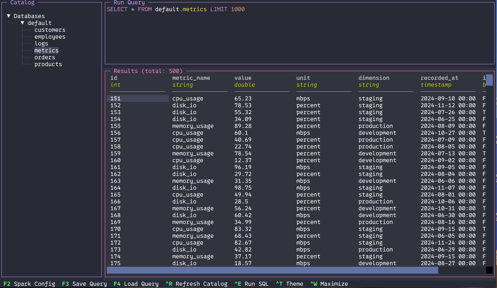

# spark-viewer-tui

A terminal UI for browsing and querying Delta Lake and Parquet tables with Apache Spark.

Built with [Textual](https://textual.textualize.io/) and [PySpark](https://spark.apache.org/docs/latest/api/python/).

GitHub: https://github.com/eritondev-stack/spark-viewer-tui



### Demo

<iframe src="https://drive.google.com/file/d/16ZDCjVVPLh7t9tRZa_h-kNbk3BJLgfB0/preview" width="100%" style="aspect-ratio: 16/9;" allow="autoplay"></iframe>


## Features

- **Catalog Browser** - Sidebar tree with databases and tables
- **SQL Editor** - Write and execute Spark SQL queries with syntax highlighting
- **Results Table** - View query results with column types and row count
- **Scan Paths** - Auto-register Delta/Parquet folders as Spark tables
- **Rescan** - Refresh tables on demand (folders are live, Ctrl+R rescans)
- **Save/Load Queries** - Persist frequently used queries
- **Themes** - Multiple color themes (Transparent, Dracula, Gruvbox)
- **Maximize** - Focus on editor or results in full screen

## Requirements

- Python 3.9+
- Java 17 (for PySpark) — must be available via `JAVA_HOME` or `java` in your `PATH`

### Java Setup

**macOS (Homebrew):**
```bash
brew install openjdk@17
export JAVA_HOME=$(/usr/libexec/java_home -v 17)
```

**Linux (Debian/Ubuntu):**
```bash
sudo apt install openjdk-17-jdk
export JAVA_HOME=/usr/lib/jvm/java-17-openjdk-amd64
```

Add the `export JAVA_HOME=...` line to your `~/.bashrc` or `~/.zshrc` to make it persistent.

**Verify:**
```bash
java -version
```

## Installation

```bash
pip install spark-viewer-tui
```

Or with [uv](https://github.com/astral-sh/uv):

```bash
uv pip install spark-viewer-tui
```

## Usage

```bash
spark-viewer
```

Or run directly from source:

```bash
uv run spark-viewer
```

## Keyboard Shortcuts

| Key | Action |
|---|---|
| `F2` | Spark Configuration (metastore, warehouse, scan paths) |
| `F3` | Save current query |
| `F4` | Load saved query |
| `Ctrl+R` | Start Spark session / Rescan paths |
| `Ctrl+E` | Execute SQL query |
| `Ctrl+T` | Change theme |
| `Ctrl+W` | Maximize editor or results |
| `Ctrl+C` | Exit |

## Getting Started

1. Run `spark-viewer`
2. Press `F2` to configure:
   - **Metastore DB Path** - Where Spark stores metadata (e.g. `/tmp/metastore_db`)
   - **Warehouse Dir Path** - Spark warehouse directory (e.g. `/tmp/spark-warehouse`)
   - **Scan Paths** - Folders to scan for Delta/Parquet tables
3. Press `Ctrl+R` to start the Spark session
4. Click a table in the sidebar or write SQL in the editor
5. Press `Ctrl+E` to run the query

## Seed (Example Data)

The package includes a seed command that creates 6 Delta tables with 500 rows each (employees, products, orders, customers, logs, metrics). Useful for testing and exploring the tool.

```bash
# Uses paths from spark_config.json
spark-viewer-seed

# Or specify paths manually
spark-viewer-seed --metastore-db ./metastore_db --warehouse-dir ./spark-warehouse
```

After seeding, run `spark-viewer` and press `Ctrl+R` to load the tables.

## Scan Paths

Scan paths auto-register Delta and Parquet tables from a directory. Each scan path has a **database name** and a **folder path**.

```
db_name: vendas
path:    /data/warehouse
```

Subfolders are registered as tables:
- Subfolder with `_delta_log/` -> Delta table
- Subfolder with `.parquet` files -> Parquet table

Every `Ctrl+R` (Refresh Catalog) drops and recreates the databases from scan paths, keeping tables in sync with the filesystem.

## Configuration

Settings are saved in `spark_config.json` in the project directory:

```json
{
  "metastore_db": "/tmp/metastore_db",
  "warehouse_dir": "/tmp/spark-warehouse",
  "scan_paths": [
    { "path": "/data/warehouse", "db_name": "vendas" },
    { "path": "/data/lake", "db_name": "analytics" }
  ]
}
```

Themes are stored in `~/.config/spark-viewer-tui/themes.json`. The file is created automatically on first run with the default themes. Edit it to customize colors or add new themes.

## Project Structure

```
spark-viewer-tui/
├── src/
│   └── spark_viewer_tui/
│       ├── app.py              # Main application
│       ├── seed.py             # Seed example Delta tables
│       ├── config.py           # Configuration management
│       ├── spark_manager.py    # Spark session and table registration
│       ├── queries.py          # Query persistence
│       ├── themes.py           # Theme system
│       └── screens/
│           ├── spark_config.py    # Spark config modal (F2)
│           ├── save_query.py      # Save query modal (F3)
│           ├── load_query.py      # Load query modal (F4)
│           └── theme_selector.py  # Theme selector modal (Ctrl+T)
└── pyproject.toml
```

## License

MIT
